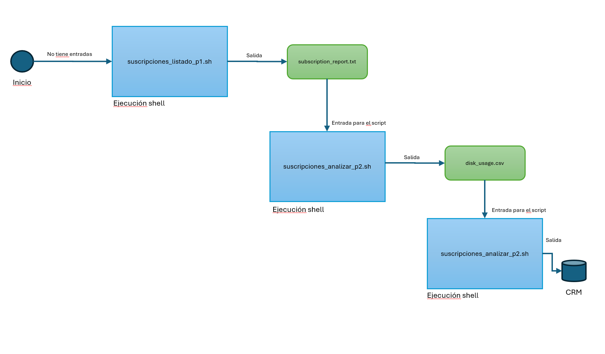

# Control de Espacio de Suscripciones en Plesk

Conjunto de Scripts utilizados para tomar lectura de PLESK y saber el espacio usado en cada membresia/dominio.

## Orden de Ejecución: 

- suscripciones_listado_p1.sh
- suscripciones_analizar_p2.sh
- suscripciones_insertcrm_p3.sh
## Diagramación del Proceso: 
- 
